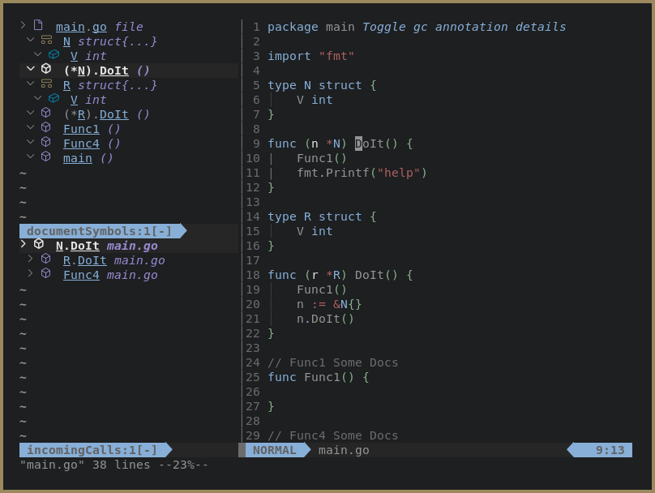

```
    /_____/\ /_______/\ /_/\     /_/\   /________/\/_____/\  /_____/\ /_____/\     
    \:::__\/ \::: _  \ \\:\ \    \:\ \  \__.::.__\/\:::_ \ \ \::::_\/_\::::_\/_    
     \:\ \  __\::(_)  \ \\:\ \    \:\ \    \::\ \   \:(_) ) )_\:\/___/\\:\/___/\   
      \:\ \/_/\\:: __  \ \\:\ \____\:\ \____\::\ \   \: __ `\ \\::___\/_\::___\/_  
       \:\_\ \ \\:.\ \  \ \\:\/___/\\:\/___/\\::\ \   \ \ `\ \ \\:\____/\\:\____/\ 
        \_____\/ \__\/\__\/ \_____\/ \_____\/ \__\/    \_\/ \_\/ \_____\/ \_____\/ 
                                                                                   
    ==============================================================================
                          Neovim's missing call-hierarchy UI
```



# Calltree.nvim

Calltree.nvim implements the missing "call-hierarchy" tree UI seen in other popular IDEs
such as Pycharm and VSCode.

Calltree.nvim allows you to start at a root symbol and discover the callers or callee's of it.

Subsequently, you can drill down the tree further to discover the "callers-of-caller" or 
the "callee's-of-callee". 

This relationship forms a tree and this is exactly how Calltree.nvim works, keeping an in
memory representation of the call tree and writing the tree out to an outline form when
requested.

Additionally, Calltree.nvim provides a live document outline UI to further help the navigation of a codebase.

# Usage

## Get it

Plug:
```
 Plug 'ldelossa/calltree.nvim'
```

## Set it

Call the setup function from anywhere you configure your plugins from.

Configuration dictionary is explained in ./doc/calltree.txt (:h calltree-config)

```
require('calltree').setup({})
```

## Use it

The setup function hooks directly into the "textDocument/incomingCalls", "textDocument/outgoingCalls", and "textDocument/documentSymbol" LSP handlers. 

To start a call tree use the LSP client just like you're used to:

```
:lua vim.lsp.buf.incoming_calls()
:lua vim.lsp.buf.outgoing_calls()
:lua vim.slp.buf.document_symbol() (symboltree outline)
```

You most likely have key mappings set for this if you're using the lsp-config.

Once the calltree or symboltree is open you can expand and collapse symbols to discover a total call hierarchy or document outline in an intuitative way.

Use ":CTExpand" and ":CTCollapse" to achieve this.

Check out (:h calltree) for all the details.

# Features

This plugin aims to be super simple and do one thing very well. 

There are a few features which add a bit more to the basic usage. 

## Switching Directions (calltree)

The ":CTSwitch" command will focus and inverse the call tree (move from outgoing to incoming for example) for the symbol under the cursor. 

## Focusing (calltree)

The ":CTFocus" command will re-parent the symbol under the cursor, making it root. 

From there you can continue down the call tree.

## Hover

The ":CTHover" will show hover info for the given symbol.

## Jump

Calltree.nvim supports jumping to the symbol. 

The ":CTJump" command will do this. 

How jumping occurs is controlled by the config, see (h: calltree-config)

Jumping will set highlights in the source file, to clear these use ":CTClearHL".

## Icons

Nerd font icons along with Codicons are currently supported. 

You'll need a patched font for them to work correctly. see (h: calltree-config)

## Symbol Outline

Because the tree module can be used for symbols as well Calltree.nvim implements a live symbol outline of the focused buffer.

Expanding and collapsing nodes is done with the same commands as the call hierarchy tree. 

The UI works together and will always ensure a static layout with call hierarchy on top/left and symbols on bottom/right.

## Unified Panel

It's possible to treat Calltree.nvim's UI as a persistent but collapsible panel. 

This would be similar to VSCode and JetBrain IDEs, where an informational panel is present on the left, bottom, right, or top of the editor depending on configuration. 

When enabling the unified panel, both the symboltree (document symbol outline) and the calltree (any recently requested call hierarchy outline) are always displayed together. 

The "CTPanel" command may be used to open and collapse the unified panel when desired. 

The configuration options `unified_panel` and `auto_open_panel` can be set to true to ensure the unified panel is opened when LSP requests are made and the unified panel is opened on Neovim's start, respectively.

The unified panel is completely opt-in. By keeping the `unified_panel` and `auto_open_panel` options false only the respectively Calltree.nvim UI elements will open when LSP requests are made. Furthermore, you can use ":CTPanel" freely without either option above set, if you'd like to "sometimes" use the unified panel without any constraints.

## Demo

[](https://user-images.githubusercontent.com/5642902/142293639-aa0d97a1-e3b0-4fc4-942e-108bfaa18793.mp4)
