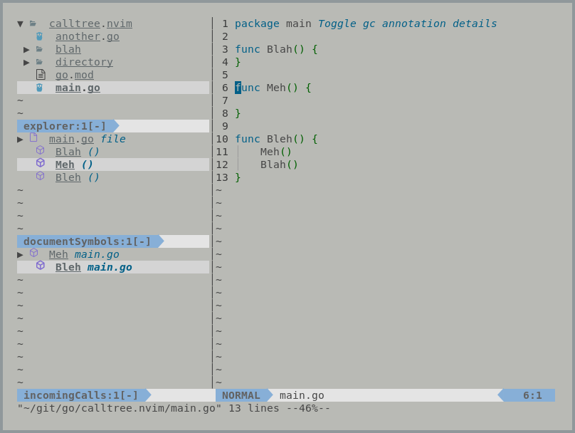

```
██╗     ██╗████████╗███████╗███████╗   ███╗   ██╗██╗   ██╗██╗███╗   ███╗
██║     ██║╚══██╔══╝██╔════╝██╔════╝   ████╗  ██║██║   ██║██║████╗ ████║ Lightweight
██║     ██║   ██║   █████╗  █████╗     ██╔██╗ ██║██║   ██║██║██╔████╔██║ Integrated
██║     ██║   ██║   ██╔══╝  ██╔══╝     ██║╚██╗██║╚██╗ ██╔╝██║██║╚██╔╝██║ Text
███████╗██║   ██║   ███████╗███████╗██╗██║ ╚████║ ╚████╔╝ ██║██║ ╚═╝ ██║ Editing
╚══════╝╚═╝   ╚═╝   ╚══════╝╚══════╝╚═╝╚═╝  ╚═══╝  ╚═══╝  ╚═╝╚═╝     ╚═╝ Environment
====================================================================================
```



# litee.nvim

Litee.nvim (pronounced lite) is a library for building "IDE-lite" experiences in Neovim. 

By utilizing the "litee" library plugin authors can achieve a consistent experience
across separate plugins.

There are several official litee plugins which can act as a reference for implementing
additional.

## Calltree
https://github.com/ldelossa/litee-calltree.nvim

Analogous to VSCode's "Call Hierarchy" tool, this plugin exposes an explorable tree
of incoming or outgoing calls for a given symbol. 

Unlike other Neovim plugins, the tree can be expanded and collapsed to discover 
"callers-of-callers" and "callees-of-callees" until you hit a leaf.

## Symboltree
https://github.com/ldelossa/litee-symboltree.nvim

Analogous to VSCode's "Outline" tool, this plugin exposes a live tree of document
symbols for the current file. 

The tree is updated as you move around and change files.

## Filetree
https://github.com/ldelossa/litee-filetree.nvim

Analogous to VSCode's "Explorer", this plugin exposes a full feature file explorer 
which supports recursive copies, recursive moves, and proper renaming of a file 
(more on this in the appropriate section).

## Bookmarks
https://github.com/ldelossa/litee-bookmarks.nvim

This plugin exposes a way to create Bookmarks, pinnable areas of important
code, and organize them into one or more Notebooks.

Notebooks allow you to open and close sets of Bookmarks depending on what
you're working on that day.

# Usage

litee.nvim is a library which other plugins can important and use. 

The library has it's own configuration and setup function which can be
viewed in the `doc.txt`.

An example of configuring the library is below:

```
require('litee.lib').setup({
    tree = {
        icon_set = "codicons"
    },
    panel = {
        orientation = "left",
        panel_size  = 30
    }
})
```
